Grammar of the language.

#### program:


```
program  ::= stmts
```

#### stmts:


```
stmts    ::= stmt*
```

referenced by:

* [for_stmt](#for_stmt)
* [program](#program)
* [stmt](#stmt)

#### stmt:

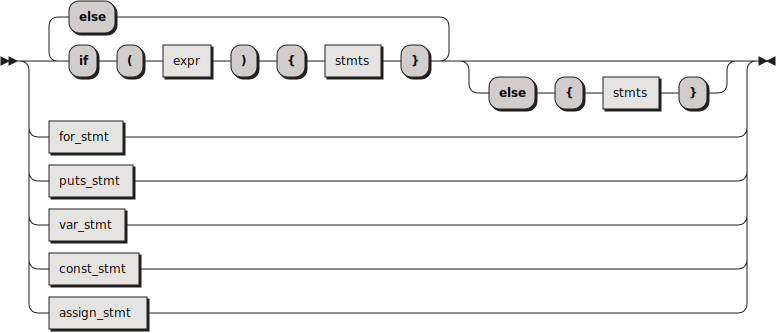

```
stmt     ::= 'if' '(' expr ')' '{' stmts '}' ( 'else' 'if' '(' expr ')' '{' stmts '}' )* ( 'else' '{' stmts '}' )?
           | for_stmt
           | puts_stmt
           | var_stmt
           | const_stmt
           | assign_stmt
```

referenced by:

* [stmts](#stmts)

#### var_stmt:


```
var_stmt ::= 'var' IDENTIFIER type ':=' expr ';'
```

referenced by:

* [for_stmt](#for_stmt)
* [stmt](#stmt)

#### const_stmt:


```
const_stmt
         ::= 'const' IDENTIFIER type ':=' expr ';'
```

referenced by:

* [stmt](#stmt)

#### assign_stmt:


```
assign_stmt
         ::= IDENTIFIER ':=' expr ';'
```

referenced by:

* [stmt](#stmt)

#### assign_expr:


```
assign_expr
         ::= IDENTIFIER ':=' expr
```

referenced by:

* [for_stmt](#for_stmt)

#### for_stmt:

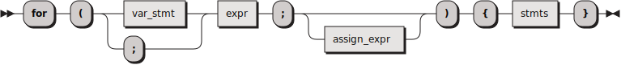

```
for_stmt ::= 'for' '(' ( var_stmt | ';' ) expr ';' assign_expr? ')' '{' stmts '}'
```

referenced by:

* [stmt](#stmt)

#### puts_stmt:


```
puts_stmt
         ::= 'puts' '(' expr ')' ';'
```

referenced by:

* [stmt](#stmt)

#### type:

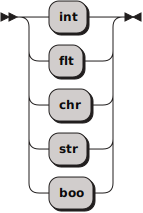

```
type     ::= 'int'
           | 'flt'
           | 'chr'
           | 'str'
           | 'boo'
```

referenced by:

* [const_stmt](#const_stmt)
* [var_stmt](#var_stmt)

#### expr:


```
expr     ::= logical_or
```

referenced by:

* [assign_expr](#assign_expr)
* [assign_stmt](#assign_stmt)
* [const_stmt](#const_stmt)
* [for_stmt](#for_stmt)
* [primary](#primary)
* [puts_stmt](#puts_stmt)
* [stmt](#stmt)
* [var_stmt](#var_stmt)

#### logical_or:

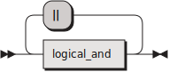

```
logical_or
         ::= logical_and ( '||' logical_and )*
```

referenced by:

* [expr](#expr)

#### logical_and:

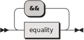

```
logical_and
         ::= equality ( '&&' equality )*
```

referenced by:

* [logical_or](#logical_or)

#### equality:

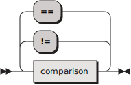

```
equality ::= comparison ( ( '!=' | '==' ) comparison )*
```

referenced by:

* [logical_and](#logical_and)

#### comparison:

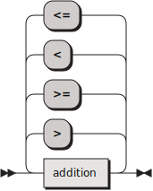

```
comparison
         ::= addition ( ( '>' | '>=' | '<' | '<=' ) addition )*
```

referenced by:

* [equality](#equality)

#### addition:

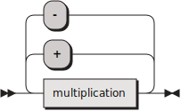

```
addition ::= multiplication ( ( '+' | '-' ) multiplication )*
```

referenced by:

* [comparison](#comparison)

#### multiplication:

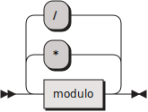

```
multiplication
         ::= modulo ( ( '*' | '/' ) modulo )*
```

referenced by:

* [addition](#addition)

#### modulo:

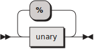

```
modulo   ::= unary ( '%' unary )*
```

referenced by:

* [multiplication](#multiplication)

#### unary:

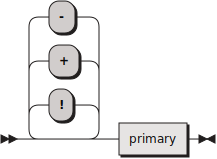

```
unary    ::= ( '!' | '+' | '-' )* primary
```

referenced by:

* [modulo](#modulo)

#### primary:

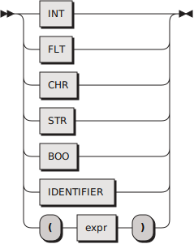

```
primary  ::= INT
           | FLT
           | CHR
           | STR
           | BOO
           | IDENTIFIER
           | '(' expr ')'
```

referenced by:

* [unary](#unary)

#### IDENTIFIER:

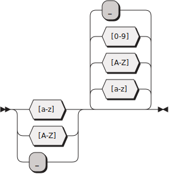

```
IDENTIFIER
         ::= [a-zA-Z_] [a-zA-Z0-9_]*
```

referenced by:

* [assign_expr](#assign_expr)
* [assign_stmt](#assign_stmt)
* [const_stmt](#const_stmt)
* [primary](#primary)
* [var_stmt](#var_stmt)

#### INT:


```
INT      ::= [0-9]+
```

referenced by:

* [primary](#primary)

#### FLT:


```
FLT      ::= [0-9]+ '.' [0-9]+
```

referenced by:

* [primary](#primary)

#### CHR:


```
CHR      ::= "'" [^'] "'"
```

referenced by:

* [primary](#primary)

#### STR:

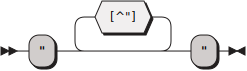

```
STR      ::= '"' [^"]* '"'
```

referenced by:

* [primary](#primary)

#### BOO:

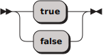

```
BOO      ::= 'true'
           | 'false'
```

referenced by:

* [primary](#primary)

## 
 <sup>generated by [RR - Railroad Diagram Generator][RR]</sup>

[RR]: https://www.bottlecaps.de/rr/ui
